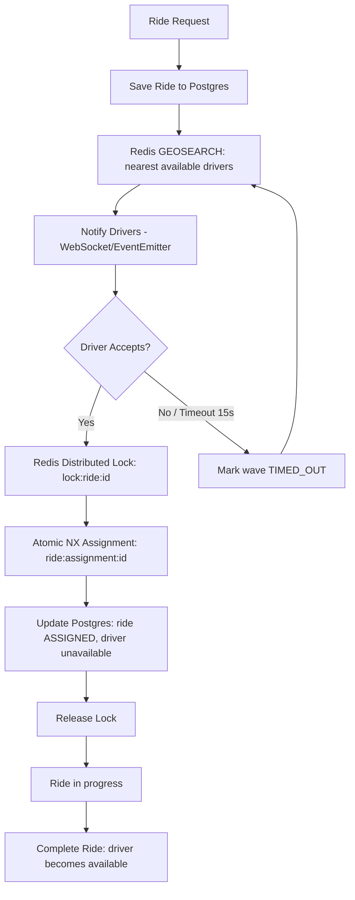

# Architecture — Vybe Cabs Backend

## High-level flow

## Component responsibilities

| Layer | Responsibility |
|---|---|
| `DriverModule` | CRUD for drivers, writes live coordinates + availability into Redis. |
| `RideModule` | Ride lifecycle state machine, nearest-driver search orchestration, concurrency-safe accept. |
| `RedisModule` | GEO index (GEOADD/GEOSEARCH), availability set, distributed lock (SET NX PX + Lua safe-release), atomic ride-assignment key (SET NX). |
| `NotificationModule` | Simulated push notifications via Socket.IO gateway + structured logs. |
| `common/filters` | Global exception filter → consistent JSON error envelope. |
| `common/interceptors` | Request/response logging with latency. |

## Concurrency model (the critical path)

Ride assignment must survive **N simultaneous "accept" calls** for the same ride with **exactly one winner**. Two independent, stacked guarantees are used:

1. **Distributed lock** (`lock:ride:{rideId}`) — acquired via `SET key value NX PX 5000`. Only one request can hold this key at a time; all others fail immediately with `409 Conflict` (fail-fast, no blocking/queueing). The lock is released via a Lua script that checks token ownership before deleting, preventing a delayed caller from deleting a lock it no longer owns.
2. **Atomic assignment key** (`ride:assignment:{rideId}`) — written via `SET key driverId NX` *inside* the lock. This is the true source of truth: even in a hypothetical scenario where the lock is bypassed, this NX write alone guarantees a single winner, because Redis executes `SET NX` atomically regardless of concurrent callers.

Combined with **idempotency checks** (a driver re-clicking Accept short-circuits to the existing assignment instead of erroring) and **late-acceptance checks** (a driver may only accept while listed in the ride's current notification wave; that membership is revoked the instant the wave times out — see `RideService.activeWaveDrivers`), this closes all known race windows.

## Timeout / retry flow

- Each "wave" of notified drivers gets `RIDE_ACCEPT_TIMEOUT_SECONDS` (default 15s) to accept.
- A `setTimeout` handle is tracked per ride; it's cleared the instant a driver wins.
- If it fires, the ride is marked `TIMEOUT`, the wave's logs flip to `TIMED_OUT`, and a fresh `GEOSEARCH` excludes previously-notified drivers, notifying the next nearest batch.
- This repeats until a driver accepts or no more drivers are found nearby.

## Data model

- **Postgres** is the durable source of truth for `drivers`, `rides`, and `ride_assignment_logs` (audit trail for RCA).
- **Redis** is the hot path for anything latency-sensitive: live GPS, availability, locking, and the win/loss decision for ride assignment.
